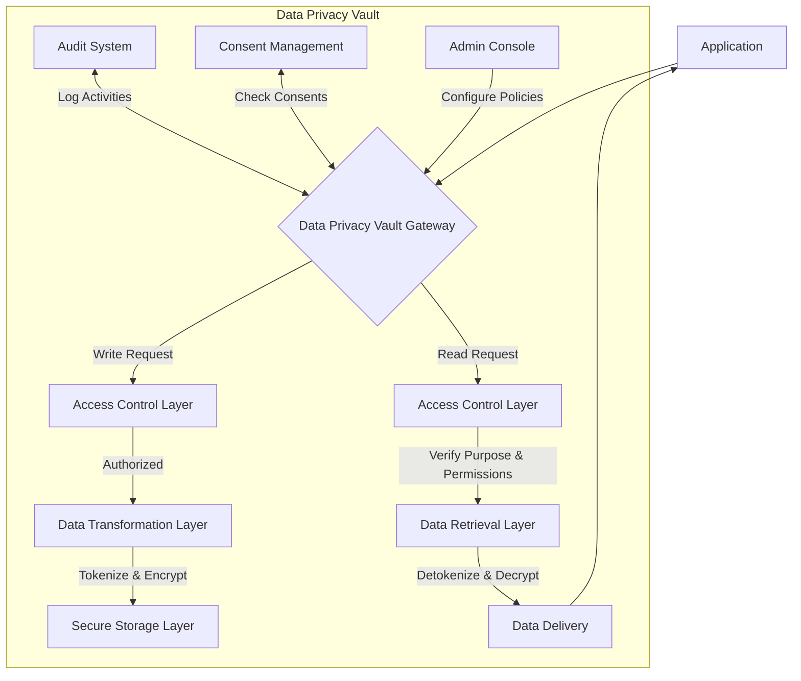
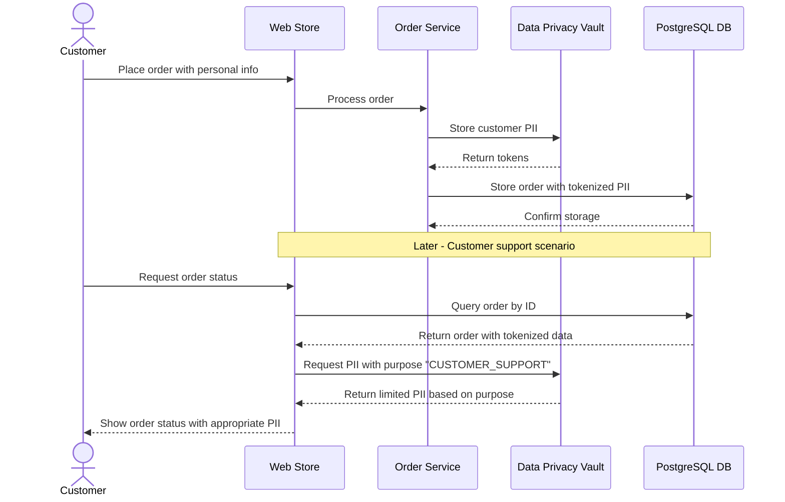

# Data Privacy Vault

## What is a Data Privacy Vault?

A Data Privacy Vault (DPV) is a specialized security architecture designed to isolate, encrypt, and protect sensitive personal data, separate from operational databases. It creates a secure boundary around Personally Identifiable Information (PII) and other sensitive data, providing an additional layer of defense against data breaches and enabling GDPR compliance through controlled access patterns, tokenization, and robust auditing capabilities.

Unlike traditional databases where sensitive and non-sensitive data are stored together, a DPV segregates PII into a dedicated, highly-secure environment with strict access controls, encryption protocols, and advanced data governance mechanisms. This architecture significantly reduces the risk surface and creates a centralized platform for applying consistent data protection and privacy policies across an organization's entire data ecosystem.

## Key Features of a Data Privacy Vault

- **Data Tokenization**: Replaces sensitive data with non-sensitive tokens in operational databases
- **Granular Access Control**: Fine-grained permissions based on roles, purposes, and regulatory requirements
- **End-to-End Encryption**: Strong encryption both at rest and in transit for all sensitive data
- **Pseudonymization Capabilities**: Creates aliases and pseudonyms to enable processing without revealing identities
- **Purpose-Based Access**: Enforces data access only for approved business purposes
- **Comprehensive Audit Logging**: Records all access attempts and data operations for compliance
- **Data Minimization Tools**: Automated mechanisms to limit data collection to what's necessary
- **Consent Management**: Tracks and enforces user consent preferences for data processing
- **Right to be Forgotten**: Supports GDPR's data deletion requirements through centralized erasure
- **Data Residency Controls**: Ensures data remains in approved geographic regions
- **De-identification Features**: Tools to anonymize data for analytics while preserving utility
- **API-First Architecture**: Secure, well-documented APIs for integration with existing systems
- **Data Lifecycle Management**: Automated enforcement of retention policies and data aging
- **Breach Notification Support**: Helps identify affected data subjects in case of incidents
- **Regulatory Compliance Reporting**: Built-in tools for generating compliance documentation

## Process Flow Diagram



## How Data Privacy Vaults Work

### High-Level Overview

A Data Privacy Vault functions as a specialized data platform that separates sensitive personal information from regular operational data. Instead of storing PII directly in application databases, the sensitive data is stored in the vault while applications work with non-sensitive tokens or references. When an application needs the real data, it makes a request to the vault, which evaluates the request against security policies, consent records, and access controls before potentially returning the actual information.

### Detailed Process Flow

1. **Data Collection and Ingestion**
   - When applications collect personal data, they route sensitive fields to the privacy vault
   - The vault validates the data structure and ensures it meets policy requirements
   - Authorization checks confirm the application has permission to store this category of data

2. **Tokenization Process**
   - The vault generates unique tokens to represent the sensitive data
   - These tokens are cryptographically secure but have no mathematical relationship to the original data
   - Applications store these tokens in their operational databases instead of the actual sensitive data
   - Different tokenization formats can be used based on requirements (preserving format, preserving relationships, etc.)

3. **Secure Storage Implementation**
   - Inside the vault, sensitive data is encrypted using strong algorithms (typically AES-256)
   - Encryption keys are managed separately using a key management system
   - Data is segmented and compartmentalized to limit exposure in case of breach
   - Additional security measures like HSMs (Hardware Security Modules) may be employed

4. **Access Control Mechanisms**
   - When an application needs to access real data, it sends the token to the vault with purpose information
   - The access control layer evaluates multiple factors:
     - Identity and authentication of the requester
     - Authorization level for this specific data category
     - Business purpose justification for the access
     - Consent status for the requested processing purpose
     - Data residency and jurisdictional requirements
   - Access decisions are made based on the combination of these factors

5. **Data Retrieval and Transformation**
   - For approved requests, the vault retrieves the encrypted data
   - Data is decrypted using the appropriate keys
   - Additional transformations may be applied based on the purpose:
     - Full data access for legitimate, authorized needs
     - Partial data access (e.g., only last 4 digits of credit card)
     - Aggregated or anonymized access for analytics
     - Age-appropriate version for certain audiences

6. **Comprehensive Audit Logging**
   - All operations are logged with detailed context:
     - Who accessed what data
     - When the access occurred
     - For what purpose
     - Whether access was granted or denied
     - What transformations were applied
   - Logs are tamper-evident and preserved for compliance purposes

7. **Privacy Rights Management**
   - The vault centralizes implementation of data subject rights:
     - Right to access: facilitates subject access requests
     - Right to rectification: provides a single point to update information
     - Right to erasure: enables complete deletion across systems
     - Right to data portability: supports standardized data export
     - Right to restrict processing: enables purpose-limitation enforcement

8. **Compliance and Governance**
   - Built-in reporting tools track regulation adherence
   - Policy enforcement is consistently applied across all data access
   - Alerts for potential policy violations or unusual access patterns
   - Regular attestation processes for access reviews

## Use Case Example: Healthcare Patient Portal Integration

### Background
A healthcare provider is developing a new patient portal that will collect and process sensitive health information. The system needs to comply with both GDPR and healthcare-specific regulations while allowing multiple systems (appointment scheduling, billing, treatment planning) to work with patient data.

### Implementation Approach

1. **Architecture Design**
   - Deploy a Data Privacy Vault to store all patient PII and health data
   - Configure operational databases to store only tokenized references
   - Establish secure API endpoints for communication with the vault

2. **Data Model and Classification**
   - Classify data fields by sensitivity level:
     - **High Sensitivity**: Medical diagnoses, treatment history, genetic information
     - **Medium Sensitivity**: Contact information, insurance details, appointment history
     - **Low Sensitivity**: Communication preferences, portal settings

3. **Integration Points**
   ```mermaid
   flowchart LR
       A[Patient Portal] --> B[API Gateway]
       C[Appointment System] --> B
       D[Billing System] --> B
       E[Treatment Planning] --> B
       B --> F[Data Privacy Vault]
       B --> G[Operational Database]
       F <--> G
   ```

4. **Implementation Steps**
   - Create schema for sensitive data storage in the vault
   - Implement tokenization patterns for different data types
   - Set up role-based access controls aligned with staff responsibilities
   - Configure purpose codes for different access patterns:
     - `TREATMENT`: Access for direct patient care
     - `BILLING`: Access for insurance and payment processing
     - `RESEARCH`: Access for anonymized data analytics
   - Develop consent management interfaces in the patient portal

5. **Data Flow Example**
   - When a patient registers:
     1. Portal collects complete patient information
     2. Sensitive fields are sent to the privacy vault
     3. Vault returns tokens for each sensitive field
     4. Portal stores tokens in operational database
   - When a doctor needs patient information:
     1. Doctor's application sends tokens to the vault with purpose "TREATMENT"
     2. Vault verifies doctor's role and purpose legitimacy
     3. If approved, vault returns necessary health information
     4. All access is logged for compliance and auditing

6. **Compliance Benefits**
   - Clear demonstration of data minimization principle
   - Precise audit trails of all data access
   - Simplified implementation of retention policies
   - Centralized mechanism for patient consent management
   - Reduced scope of compliance requirements for ancillary systems

This approach ensures that sensitive patient data receives maximum protection while still enabling the healthcare provider to deliver effective services. The Data Privacy Vault creates a clear boundary around PII, simplifying compliance efforts and reducing security risks.

## Integrating with Existing PostgreSQL Databases

Yes, a Data Privacy Vault can be seamlessly integrated with an existing PostgreSQL database. This approach allows organizations to enhance their data protection capabilities without completely rebuilding their data infrastructure. The integration follows a pattern of identifying sensitive data, extracting it to the vault, and replacing it with tokens in the original database.

### Integration Steps

1. **Data Discovery and Classification**
   - Audit existing PostgreSQL schema to identify PII and sensitive data columns
   - Classify discovered data based on sensitivity levels and regulatory requirements
   - Document the relationships and dependencies between sensitive and non-sensitive data

2. **Vault Infrastructure Setup**
   - Deploy the Data Privacy Vault infrastructure (either as a service or self-hosted)
   - Configure secure connectivity between your existing database environment and the vault
   - Set up encryption keys and security policies aligned with your compliance requirements

3. **Schema Adaptation**
   - Modify your PostgreSQL schema to replace sensitive columns with token columns
   - Example transformation:

   ```
   -- Original table with sensitive data
   CREATE TABLE customers (
     id SERIAL PRIMARY KEY,
     full_name VARCHAR(100),
     email VARCHAR(100),
     phone_number VARCHAR(20),
     date_of_birth DATE,
     address TEXT,
     loyalty_points INTEGER
   );
   
   -- Modified table with tokenized fields
   CREATE TABLE customers (
     id SERIAL PRIMARY KEY,
     full_name_token VARCHAR(100),
     email_token VARCHAR(100),
     phone_number_token VARCHAR(100),
     date_of_birth_token VARCHAR(100),
     address_token VARCHAR(100),
     loyalty_points INTEGER
   );
   ```

4. **Data Migration and Tokenization**
   - Develop a migration script that:
     1. Reads sensitive data from the original PostgreSQL tables
     2. Sends this data to the privacy vault for storage
     3. Receives tokens in return
     4. Updates the original tables with tokens replacing the sensitive data
   - Consider using database triggers for ongoing synchronization

   ```mermaid
   sequenceDiagram
       participant DB as PostgreSQL DB
       participant MS as Migration Script
       participant DPV as Data Privacy Vault
       
       MS->>DB: Read records with sensitive data
       DB-->>MS: Return data records
       
       loop For each sensitive field
           MS->>DPV: Store sensitive value
           DPV-->>MS: Return token
           MS->>DB: Update record with token
       end
       
       Note over DB,DPV: After migration, only tokens remain in PostgreSQL
   ```

5. **Application Layer Integration**
   - Modify application code to:
     - Work with tokenized data for most operations
     - Request actual data from the vault only when necessary
     - Include purpose justification with data access requests
   - Implement the vault client library or API integration in your application services

   ```mermaid
   flowchart TD
       A[Web Application] --> B[Application Server]
       B --> C{Need Sensitive Data?}
       C -->|No| D[Query PostgreSQL Directly]
       C -->|Yes| E[Call Vault API with Token]
       E --> F[Data Privacy Vault]
       F --> G[Return Sensitive Data]
       G --> B
       D --> H[PostgreSQL Database]
       H --> I[Return Tokenized Data]
       I --> B
   ```

6. **Access Control Implementation**
   - Define access policies in the vault based on:
     - User roles and responsibilities
     - Business purposes for data access
     - Regulatory restrictions
   - Implement authentication integration between your application, the vault, and PostgreSQL

7. **Audit and Monitoring Setup**
   - Configure comprehensive logging for all sensitive data access
   - Implement alerts for suspicious access patterns
   - Create dashboards for privacy compliance monitoring

### Technical Implementation Approaches

There are several approaches to implement this integration:

1. **Database Extension Approach**
   - Use PostgreSQL extensions or plugins that connect to the Data Privacy Vault
   - Leverage PostgreSQL's function capabilities to create custom tokenization functions
   - Example:
     ```sql
     -- Custom function that interfaces with the vault
     CREATE FUNCTION tokenize(value text, field_type text) RETURNS text AS $$
     -- Function would call the vault API and return a token
     $$ LANGUAGE plpgsql;
     
     -- Usage in queries
     UPDATE customers SET email_token = tokenize(email, 'email');
     ```

2. **Proxy Layer Approach**
   - Implement a database proxy that intercepts queries
   - The proxy automatically handles tokenization/detokenization
   - Applications connect to the proxy instead of directly to PostgreSQL

   ```mermaid
   flowchart LR
       A[Application] --> B[DB Proxy]
       B --> C[Data Privacy Vault]
       B --> D[PostgreSQL Database]
       subgraph "Transparent to Application"
       B
       C
       D
       end
   ```

3. **Microservice Approach**
   - Create a dedicated service responsible for vault operations
   - Application services call this microservice when they need to handle sensitive data
   - Maintains clean separation of concerns

### Considerations for Existing Data

When integrating with a mature PostgreSQL database, consider these additional factors:

- **Performance Impact**: Tokenization/detokenization adds latency to operations requiring sensitive data
- **Query Complexity**: Queries that previously filtered or sorted by sensitive fields may need redesign
- **Backup Strategy**: Tokenized PostgreSQL backups are less sensitive, but vault backups require special security
- **Data Integrity**: Maintaining referential integrity between tokenized fields requires careful planning
- **Search Capability**: Consider format-preserving tokenization or search indices in the vault for searchable tokens

### Example: Adding a Vault to an E-commerce Platform



By following these integration steps, organizations can significantly enhance their data protection posture while continuing to leverage their existing PostgreSQL database investments. The approach provides a path to GDPR compliance without requiring a complete system redesign.
