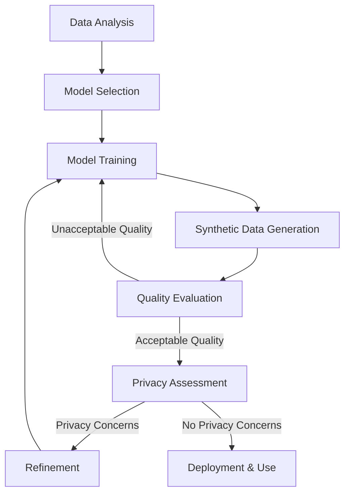
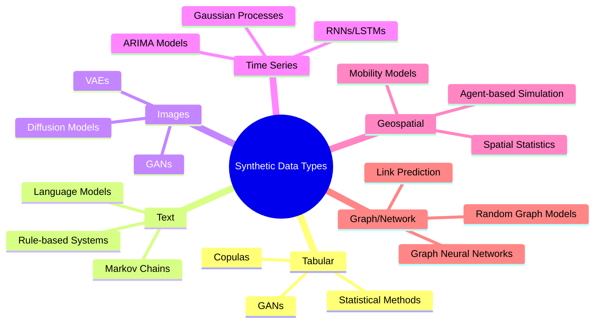
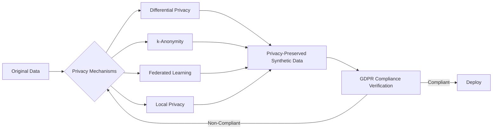
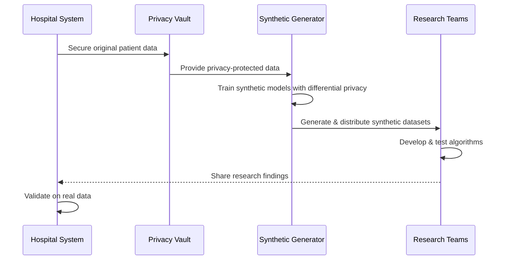
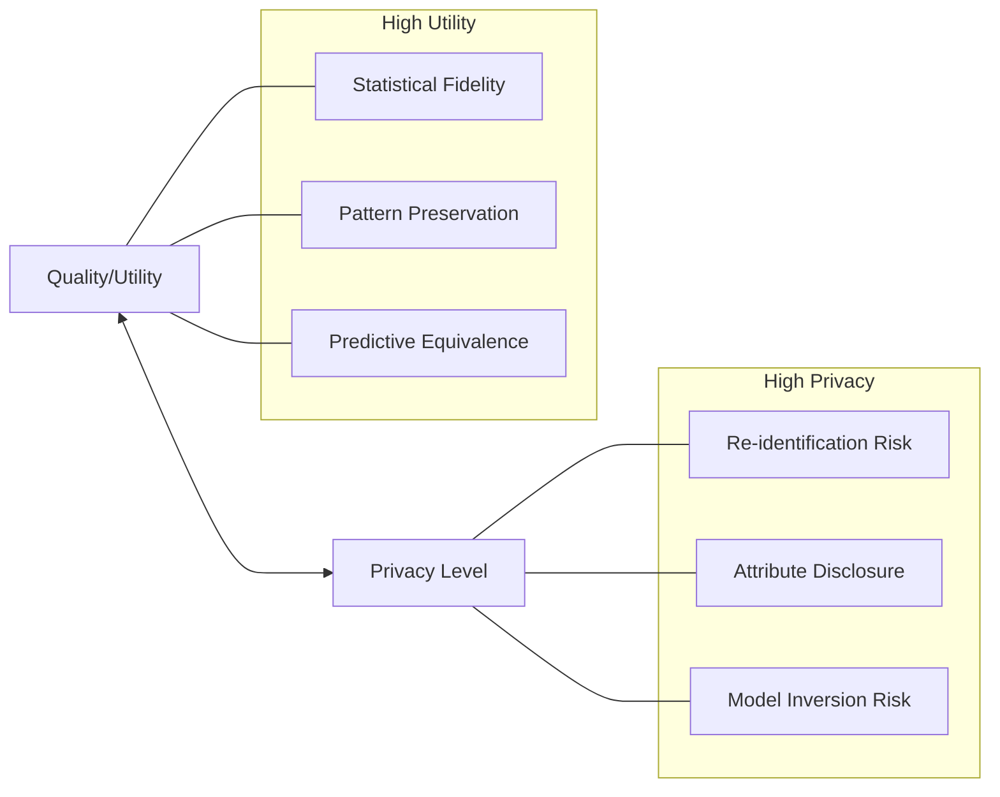
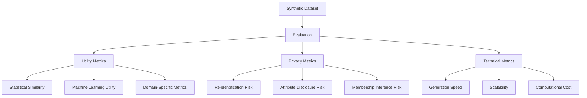
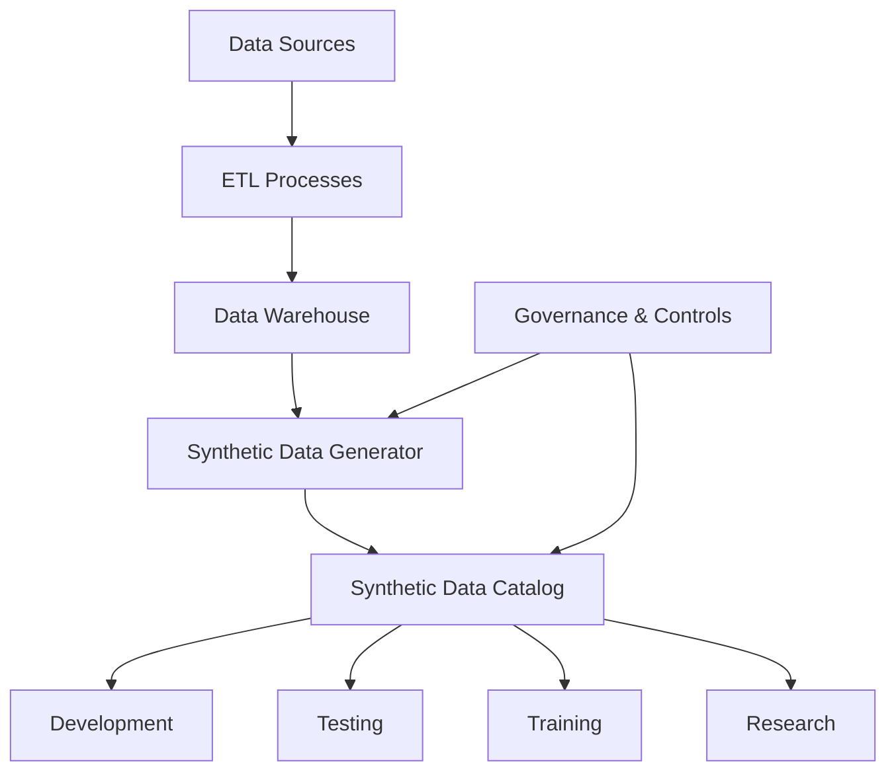

# Synthetic Data Generation

## 1. What is Synthetic Data?

Synthetic data is artificially generated information that mimics the statistical properties and patterns of real data without containing any actual information from the original dataset. It is created using algorithms and models that learn the characteristics, relationships, and distributions present in real data, then generate new data points that maintain these properties while being completely artificial.

### Key Characteristics of Synthetic Data:

- **Privacy-Preserving**: Does not contain actual records from real individuals
- **Customizable**: Can be tailored to specific needs and use cases
- **Scalable**: Can generate unlimited amounts of data
- **Representative**: Maintains statistical properties of the original data
- **Controllable**: Allows manipulation of specific features and properties

### Benefits of Synthetic Data:

- **Enhanced Privacy Protection**: Addresses GDPR and other privacy regulations by eliminating the risk of exposing sensitive personal information
- **Unlimited Availability**: Can generate as much data as needed without collection limitations
- **Reduced Bias**: Can be designed to correct biases present in original datasets
- **Cost Efficiency**: Eliminates or reduces expensive data collection processes
- **Accelerated Development**: Enables faster development cycles by providing immediate access to test data
- **Edge Case Testing**: Can generate rare scenarios that might be difficult to find in real data

## 2. How Synthetic Data Works

Synthetic data is created through various generation techniques that analyze patterns in real data and produce artificial data with similar characteristics. These methods range from simple statistical approaches to advanced deep learning models.

### Key Generation Techniques:

#### 2.1 Statistical Methods

- **Monte Carlo Simulation**: Generates data based on probability distributions derived from real data
- **Parametric Synthesis**: Creates data by sampling from fitted statistical distributions
- **Agent-Based Modeling**: Simulates interactions between entities to generate realistic behavioral data

#### 2.2 Machine Learning Approaches

- **Generative Adversarial Networks (GANs)**: Uses two competing neural networks - a generator that creates synthetic data and a discriminator that tries to distinguish it from real data
- **Variational Autoencoders (VAEs)**: Neural networks that learn compact representations of data and generate new samples
- **Copula-Based Methods**: Captures dependencies between variables and generates multivariate data with similar correlation structures
- **Diffusion Models**: Creates data by gradually adding and then removing noise from random samples

#### 2.3 Deep Synthesis Techniques

- **Language Models**: For text data, large language models can generate synthetic text with realistic linguistic properties
- **Synthetic Imaging**: For visual data, specific models can generate realistic synthetic images, videos, or medical scans
- **Tabular Data Synthesis**: Specialized models for generating structured tabular data with complex relationships

## 3. Synthetic Data Generation Workflow

The process of generating synthetic data follows a structured workflow from data analysis to validation and deployment.

### Detailed Workflow Steps:

1. **Data Analysis**
   - Explore original data to understand structure, relationships, and distributions
   - Identify sensitive attributes requiring special handling
   - Determine key statistical properties to preserve

2. **Model Selection**
   - Choose appropriate generation technique based on data type and use case
   - Consider complexity, accuracy requirements, and computational resources
   - Select privacy-preserving mechanisms suitable for the data sensitivity

3. **Model Training**
   - Train the selected model on original data
   - Optimize model parameters to balance accuracy and privacy
   - Implement differential privacy if required to provide mathematical privacy guarantees

4. **Synthetic Data Generation**
   - Use the trained model to generate new synthetic datasets
   - Apply constraints to ensure logical consistency
   - Scale generation to meet volume requirements

5. **Quality Evaluation**
   - Compare statistical properties between synthetic and original data
   - Verify utility for intended use cases
   - Test downstream applications with synthetic data

6. **Privacy Assessment**
   - Perform privacy attacks to assess re-identification risks
   - Measure information leakage
   - Ensure GDPR compliance through privacy impact assessment

7. **Refinement**
   - Adjust generation parameters based on quality and privacy evaluations
   - Iterate until achieving optimal balance between utility and privacy

8. **Deployment & Use**
   - Integrate synthetic data into workflows and systems
   - Document generation process for transparency
   - Monitor usage and effectiveness

## 4. Data Types and Generation Techniques

Different data types require specialized approaches for synthetic generation.

## 5. Privacy Preservation in Synthetic Data

Ensuring privacy in synthetic data is crucial, especially in the context of GDPR compliance.

### Key Privacy Techniques:

- **Differential Privacy**: Adds calibrated noise to ensure that the presence or absence of any individual record doesn't significantly affect the output
- **k-Anonymity**: Ensures that any individual in the dataset cannot be distinguished from at least k-1 other individuals
- **Federated Learning**: Trains models across multiple devices or servers without exchanging the actual data
- **Local Privacy**: Applies privacy-preserving transformations before data leaves its source

### GDPR Considerations:

- **Article 4(1)**: Synthetic data, if properly generated, may not contain personal data as defined by GDPR
- **Article 9**: Synthetic data can help avoid processing special categories of personal data
- **Article 25**: Synthetic data supports privacy by design and default principles
- **Article 35**: Reduces the need for Data Protection Impact Assessments
- **Article 32**: Enhances security measures through pseudonymization and anonymization

## 6. Real-Life Use Case Example: Healthcare Data for Research

### Background
A hospital network needs to share patient data with external researchers for developing new diagnostic algorithms but faces strict privacy regulations (GDPR, HIPAA) that limit data sharing.

### Challenge
- Patient medical records contain highly sensitive personal information
- Research requires access to detailed clinical patterns and correlations
- Traditional anonymization would destroy valuable relationships in the data
- Risk of re-identification is high with conventional approaches

### Solution: Synthetic Patient Data Generation

#### Implementation Steps:

1. **Data Preparation**
   - Identify required data elements (demographics, diagnoses, treatments, outcomes)
   - Establish preservation priorities (disease progression patterns, treatment correlations)
   - Define privacy constraints (no unique identifiers, no rare conditions that could enable re-identification)

2. **Model Selection & Training**
   - Choose GANs specialized for medical data
   - Implement differential privacy with ε=3.0 (strong privacy guarantee)
   - Train models on sequestered data within hospital secure environment

3. **Synthetic Data Generation**
   - Generate 100,000 synthetic patient records
   - Validate statistical fidelity using KL-divergence and utility metrics
   - Perform membership inference attacks to verify privacy

4. **Research Application**
   - Distribute synthetic datasets to qualified research teams
   - Enable unrestricted experimentation without privacy concerns
   - Support international collaboration without data transfer restrictions

5. **Validation Process**
   - Research findings tested on real data within hospital environment
   - Only aggregated results shared externally
   - Continuous improvement of synthetic data quality based on utility feedback

#### Outcomes:

- **Research Acceleration**: Research teams developed algorithms 40% faster with unlimited access to synthetic data
- **Privacy Protection**: No personal data left the hospital environment
- **GDPR Compliance**: Full compliance achieved without research limitations
- **Model Quality**: Algorithms trained on synthetic data achieved 92% of the performance of those trained on real data
- **Collaboration**: International research partnerships formed without complex data sharing agreements

## 7. Advanced Considerations for Synthetic Data

### 7.1 Quality vs. Privacy Tradeoff

The fundamental challenge in synthetic data generation is balancing data utility with privacy protection. More aggressive privacy measures often reduce the utility of the synthetic data, while preserving more patterns from original data may increase privacy risks.

### 7.2 Synthetic Data Evaluation Framework

A comprehensive evaluation framework helps ensure that synthetic data meets both utility requirements and privacy standards.

### 7.3 Integration with Existing Systems

Synthetic data needs to integrate with existing data infrastructure, requiring consideration of ETL processes, data storage, governance, and access controls.

## 8. Conclusion

Synthetic data represents a transformative approach to data utilization that balances the need for rich, representative data with stringent privacy requirements. By generating artificial data that preserves statistical properties without containing actual personal information, organizations can:

- Comply with privacy regulations like GDPR
- Accelerate development and testing
- Enable data sharing and collaboration
- Enhance AI/ML model training
- Address data imbalances and biases

As regulations become stricter and privacy concerns grow, synthetic data will continue to play a crucial role in enabling innovation while protecting individual privacy.

The techniques and workflows described in this document provide a foundation for implementing synthetic data generation in a way that is both effective and responsible, ensuring the resulting data is useful, secure, and compliant with relevant regulations.
